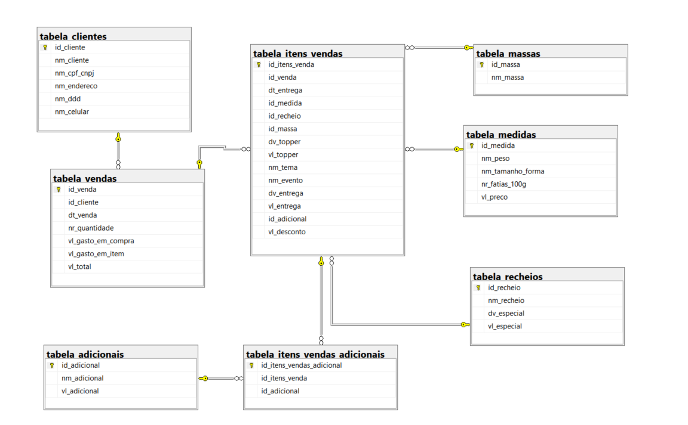

## 📊 Database LadyCake

### Projeto de Banco de Dados em SQL Server para microempresa de confeitaria

Este repositório contém o desenvolvimento de um **banco de dados em SQL Server** para a microempresa *LadyCake*, voltada à produção e venda de bolos confeitados para aniversários e eventos.

O projeto foi modelado respeitando **regras de negócio**, garantindo **integridade dos dados** e oferecendo suporte ao controle de vendas, produtos e clientes.

---

## 🧠 Visão Geral do Projeto

O banco de dados contempla:

* Criação do banco do zero com **filegroups separados**
* Modelagem de tabelas baseada no negócio
* Scripts de inserção de dados
* Criação de **índices para performance**
* **View** dinâmica para consulta de informações
* **Stored Procedures** para:

  * Inserção de pedidos
  * Exclusão de pedidos
* Aplicação de conceitos de **SQL Tuning**

Todas as informações sensíveis foram omitidas ou anonimizadas.
O projeto é destinado a **estudo, portfólio e aprendizado**, não devendo ser utilizado em produção sem revisão.

---

## 🧩 Diagrama Entidade-Relacionamento (DER)

A imagem abaixo representa o **Diagrama Entidade-Relacionamento**, demonstrando a estrutura lógica do banco de dados e os relacionamentos entre as entidades.

<p align="center">
  
</p>

---

## 🗂️ Estrutura do Projeto

```text
src/
└─ database/
   ├─ ddl/
   │  ├─ 01_create_database.sql
   │  └─ tables/
   │     ├─ 01_tabela_medidas.sql
   │     ├─ 02_tabela_recheios.sql
   │     ├─ 03_tabela_massas.sql
   │     ├─ 04_tabela_clientes.sql
   │     ├─ 05_tabela_vendas.sql
   │     ├─ 06_tabela_adicionais.sql
   │     ├─ 07_tabela_itens_vendas.sql
   │     └─ 08_tabela_itens_vendas_adicionais.sql
   │
   ├─ dml/
   │  └─ 01_inserir_lady_cake.sql
   │
   ├─ procedures/
   │  ├─ 01_pc_inserir_pedidos.sql
   │  └─ 02_pc_deletar_pedidos.sql
   │
   └─ views/
      └─ 01_view_lady_cake.sql

docs/
└─ imagens/
   └─ diagrama_entidade_relacionamento.png
```

---

## 🛠️ Tecnologias Utilizadas

<p align="left">
  <a href="https://www.microsoft.com/sql-server" target="_blank" rel="noreferrer">
    
  </a>
</p>

* SQL Server
* T-SQL
* Stored Procedures
* Índices e otimização de consultas

---

## 🏪 Sobre a LadyCake

A LadyCake é uma microempresa fundada por **Leide Sena**, atuando desde fevereiro de 2022 em Planaltina – GO.
O negócio é especializado na produção artesanal de bolos para eventos e comemorações.

<p align="left">
  <a href="https://www.facebook.com/profile.php?id=100083081037204" target="_blank">
    
  </a>
  <a href="https://instagram.com/ladycake2205" target="_blank">
    
  </a>
</p>

---
